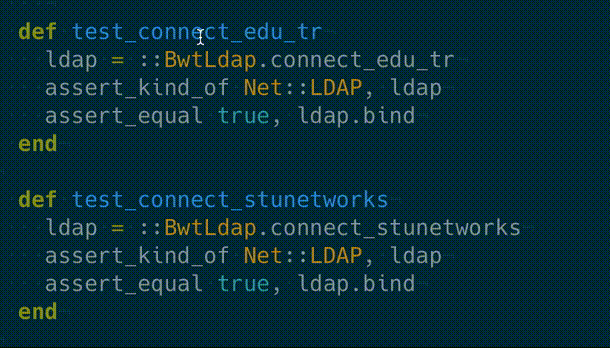

# Ruby "minitest" Runner for TextMate2

This bundle includes some helpful snippets and test-runner features
for minitest.

## Installation

```bash
cd "~/Library/Application Support/Avian/Bundles/"
# if you don’t have Avian/Bundles folder, you need to create it!

git clone https://github.com/vigo/textmate2-ruby-minitest-runner.git textmate2-ruby-minitest-runner.tmbundle
# reload your TextMate2
```

## Features



Some screenshots are available under `Screenshots/` folder.

## Available Helpers

Go to you `test/` folder; open your test file and hit `alt (⌥) + cmd (⌘) + R`


`ase`: completes;

    assert_empty
    assert_equal
    assert_in_delta
    assert_in_epsilon
    assert_includes
    assert_instance_of
    assert_kind_of
    assert_match
    assert_nil
    assert_operator
    assert_output
    assert_raises
    assert_respond_to
    assert_same
    assert_silent
    assert_throws

`ref`: completes;

    refute_empty
    refute_equal
    refute_in_delta
    refute_in_epsilon
    refute_includes
    refute_instance_of
    refute_kind_of
    refute_match
    refute_nil
    refute_operator
    refute_respond_to
    refute_same

`mus`: completes;

    must_be_empty
    must_equal
    must_be_within_delta
    must_be_close_to
    must_be_within_epsilon
    must_include
    must_be_instance_of
    must_be_kind_of
    must_match
    must_be_nil
    must_be
    must_output
    must_raise
    must_respond_to
    must_be_same_as
    must_be_silent
    must_throw

`won`: completes;

    wont_be_empty
    wont_equal
    wont_be_within_delta
    wont_be_close_to
    wont_be_within_epsilon
    wont_include
    wont_be_instance_of
    wont_be_kind_of
    wont_match
    wont_be_nil
    wont_be
    wont_respond_to
    wont_be_same_as

***

## Change Log

Current version: `v0.1.0`

**2016-03-23**

* Unit Test and Spec; assertions, refutes added.
* Initial commit.

***

## Contributers

* [Uğur "vigo" Özyılmazel](https://github.com/vigo) - Creator, maintainer

***

## Contribute

PR’s are very welcome!

1. `fork` (https://github.com/vigo/textmate2-ruby-minitest-runner/fork)
2. Create your `branch` (`git checkout -b my-features`)
3. `commit` yours (`git commit -am 'added killer features'`)
4. `push` your `branch` (`git push origin my-features`)
5. Than create a new **Pull Request**!


***

## License

This project is licensed under MIT.